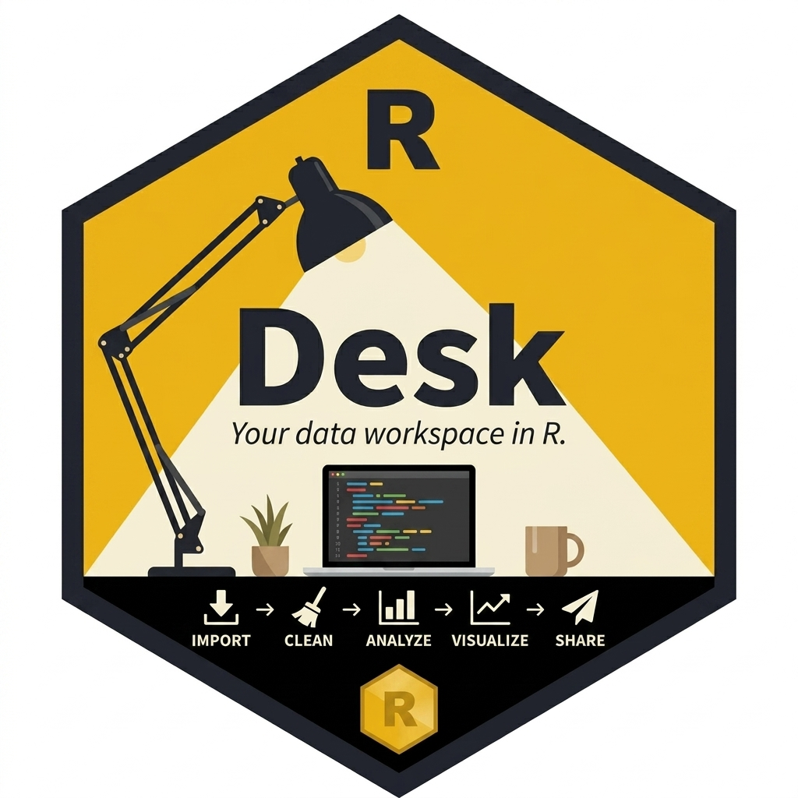

# RDesk

<p align="center">
  
</p>

<p align="center">
  <a href="https://CRAN.R-project.org/package=RDesk"></a>
  <a href="https://github.com/Janakiraman-311/RDesk/actions/workflows/R-CMD-check.yml"></a>
  <a href="https://janakiraman-311.github.io/RDesk/"></a>
  
  
</p>

<p align="center">
  <strong>Package R analyses into self-contained Windows desktop applications with zero network port requirements.</strong>
</p>

---

**RDesk** packages your R analysis into a standalone Windows application. By eliminating the need for an HTTP server, RDesk runs fully offline and provides your users with a self-contained `.exe` that launches a native desktop interface.

## Quick Start

```r
# Install from CRAN
install.packages("RDesk")

# Scaffold an interactive dashboard
RDesk::rdesk_create_app("MyApp")

# Run it immediately
source("MyApp/app.R")
```

When you are ready to ship:

```r
RDesk::build_app(
  app_dir         = "MyApp",
  app_name        = "MyApp",
  build_installer = TRUE
)
# → dist/MyApp-1.0.0-setup.exe  (~200 MB, self-contained)
```

Send the `.exe` to anyone on Windows. They double-click it to install and run the application. No R pre-installation is required.

> **Development version:**
> ```r
> devtools::install_github("Janakiraman-311/RDesk")
> ```

## Why RDesk?

| Feature | Shiny | RInno (archived) | Electron + R | **RDesk** |
|:---|:---:|:---:|:---:|:---:|
| Network ports required | ✅ Yes | ✅ Yes | ✅ Yes | ❌ **Zero** |
| Works fully offline | ❌ No | ⚠️ Partial | ⚠️ Partial | ✅ **Yes** |
| Native file dialogs & menus | ❌ No | ❌ No | ⚠️ Via JS | ✅ **Yes** |
| Distribution format | Server URL | Installer | Installer | **ZIP or .exe** |
| Bundle size | Server-side | 350 MB+ | 350–500 MB | **~200 MB** |
| Skills required | R | R + Electron | R + Node.js | **R only** |

## Core Features

- **🔒 Zero-Port IPC** - R and the UI communicate via native stdin/stdout pipes and Win32 messages. Avoids TCP port binding entirely, streamlining compliance and security reviews in restricted enterprise environments.
- **⚡ Async by Default** - Non-blocking asynchronous processing using `mirai` daemon pools. Simplifies progress updates, loading states, and cancellation flows.
- **📦 Version-Safe Runtime** - `build_app()` copies your exact R installation into the bundle, guaranteeing the runtime and your `renv`-locked packages are always the same version.
- **🎨 Modern Web UI** - Write your interface in plain HTML/CSS/JS. Keep 100% of your logic in R. No React, Webpack, or build pipeline required.
- **🛠 Automated Scaffolding** - `rdesk_create_app()` scaffolds a functional application template featuring a sidebar, dynamic charts, async handlers, and built-in theme support.
- **🔄 Auto-Update** - One function silently checks for updates on launch and installs them, ensuring distributed users are always up to date.

## Who It's For

RDesk is built for R developers who need to package a local statistical or data tool for non-R users.

- **Pharma & clinical** - distribute data review or validation tools to clinical investigators for direct offline execution
- **Consulting** - package analytical models into branded tools for direct deployment without exposing proprietary source code
- **Internal teams** - transition complex spreadsheet macros to structured R scripts packaged as a familiar `.exe`
- **Standalone deployment** - build apps for environments where local network port binding is constrained or unavailable

## Documentation

Full documentation at **[janakiraman-311.github.io/RDesk](https://janakiraman-311.github.io/RDesk/)**

| Guide | What it covers |
|:---|:---|
| [Getting Started](https://janakiraman-311.github.io/RDesk/articles/getting-started.html) | From `install.packages()` to your first native app |
| [Coming from Shiny](https://janakiraman-311.github.io/RDesk/articles/shiny-migration.html) | Side-by-side mapping of every Shiny pattern to RDesk |
| [Async Guide](https://janakiraman-311.github.io/RDesk/articles/async-guide.html) | Background tasks, progress overlays, cancellation |
| [Cookbook](https://janakiraman-311.github.io/RDesk/articles/cookbook.html) | Copy-paste recipes for common desktop patterns |
| [Why RDesk?](https://janakiraman-311.github.io/RDesk/articles/rdesk-article.html) | The history of R desktop deployment |

## License

MIT © Janakiraman G.
