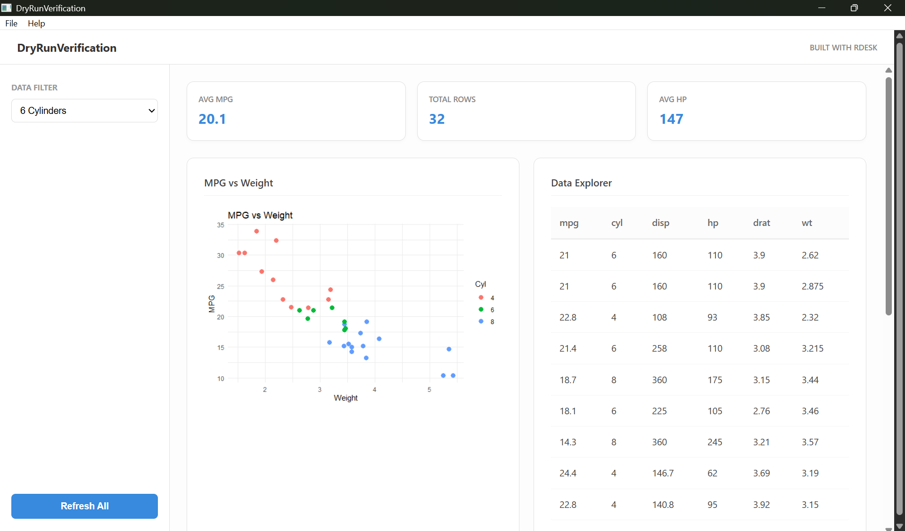

# Getting Started with RDesk

``` r

# Verify RDesk is installed correctly
packageVersion("RDesk")
#> [1] '1.0.7'
# Check that the example app is bundled (if existing)
app_path <- system.file("templates/hello", package = "RDesk")
if (nzchar(app_path)) {
  file.exists(app_path)
}
#> [1] TRUE
```

## Desktop Deployment for R

Data analysts build powerful tools in R, but sharing them with
non-technical users is difficult. Shiny is excellent for web dashboards,
but it requires a server and a steady network connection.

**RDesk** solves this by packaging your R code into a **native desktop
application**. It runs as a standalone bundle/executable with zero
network overhead and no server required.

## 1. Installation

RDesk works out-of-the-box on modern systems (Windows, macOS, and
Linux). You only need **R** and a C++ compiler/toolchain (like Rtools on
Windows, Xcode Command Line Tools on macOS, or GCC/clang on Linux)
installed.

``` r

# Install from CRAN
install.packages("RDesk")
library(RDesk)
```

## 2. Your First App (Automated Scaffolding)

The fastest way to build an RDesk application is using the built-in
scaffolding tool. This generates a functional dashboard template
featuring a sidebar, KPI cards, and an asynchronous charting engine.

``` r

library(RDesk)

# Create a dashboard template in a new directory
RDesk::rdesk_create_app("MyDashboard")
```



RDesk Dashboard

Navigate to the `MyDashboard` folder and run `app.R` to see the results.

## 3. Building a Standalone Executable

The core value of RDesk is the ability to turn your R code into a
standalone `.exe` that runs on any machine without requiring a
pre-installed R version.

> **First build note:** RDesk copies the active R runtime and
> already-installed package dependencies into the bundle. Install
> application dependencies in the development library before calling
> [`build_app()`](https://janakiraman-311.github.io/RDesk/reference/build_app.md).

``` r

# Build a portable ZIP bundle
RDesk::build_app(
  app_dir  = "MyDashboard",
  app_name = "MyFirstApp"
)
```

The resulting `.zip` file in the `dist/` folder contains exactly what
you need to distribute your tool. The end-user simply unzips and runs
`MyFirstApp.exe`.

### Using renv for reproducibility

If your project uses `renv`, commit your `renv.lock` in the project
root. RDesk’s GitHub Actions workflows will automatically restore from
that lockfile before building. Additionally,
[`build_app()`](https://janakiraman-311.github.io/RDesk/reference/build_app.md)
writes a bundle-level `renv.lock` into each distributable when `renv` is
active.

## 4. Key Concepts

### Zero-Port IPC

Zero network ports, zero firewall issues. Communication happens over
standard input/output using a high-speed JSON protocol.

### Async Processing

Use the
[`async()`](https://janakiraman-311.github.io/RDesk/reference/async.md)
wrapper to run heavy R tasks without blocking the UI event loop:

``` r

app$on_message("heavy_task", async(function(msg) {
  Sys.sleep(2) # Simulate work
  list(status = "Done")
}, app = app))
```

## Next Steps

- [**Coming from
  Shiny**](https://janakiraman-311.github.io/RDesk/articles/shiny-migration.md) -
  Map your existing Shiny knowledge to the RDesk mental model.
- [**Cookbook**](https://janakiraman-311.github.io/RDesk/articles/cookbook.md) -
  Common recipes for file dialogs, charts, and native menus.
- [**Async
  Guide**](https://janakiraman-311.github.io/RDesk/articles/async-guide.md) -
  Deep dive into background task management.
